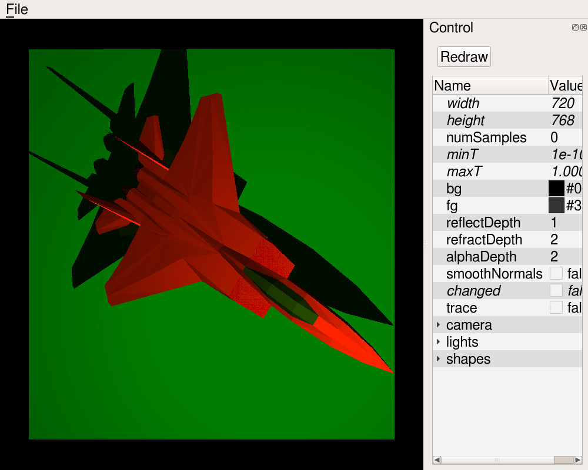

# CQRayTrace #
Qt Ray Tracer

# CRayTrace #
Ray tracer

# CRayShape #
Shapes for raytracer

# CRayTexture #
Texture classes for raytracer (image, marble, noise)

# CImageRayTrace #
Ray trace to an image

# CCeilRayTrace #
CCeil commands for ray trace

# CQRayTraceCmd #
Ray Trace Command ?

# CXRayTrace #
X11 Ray Tracer
